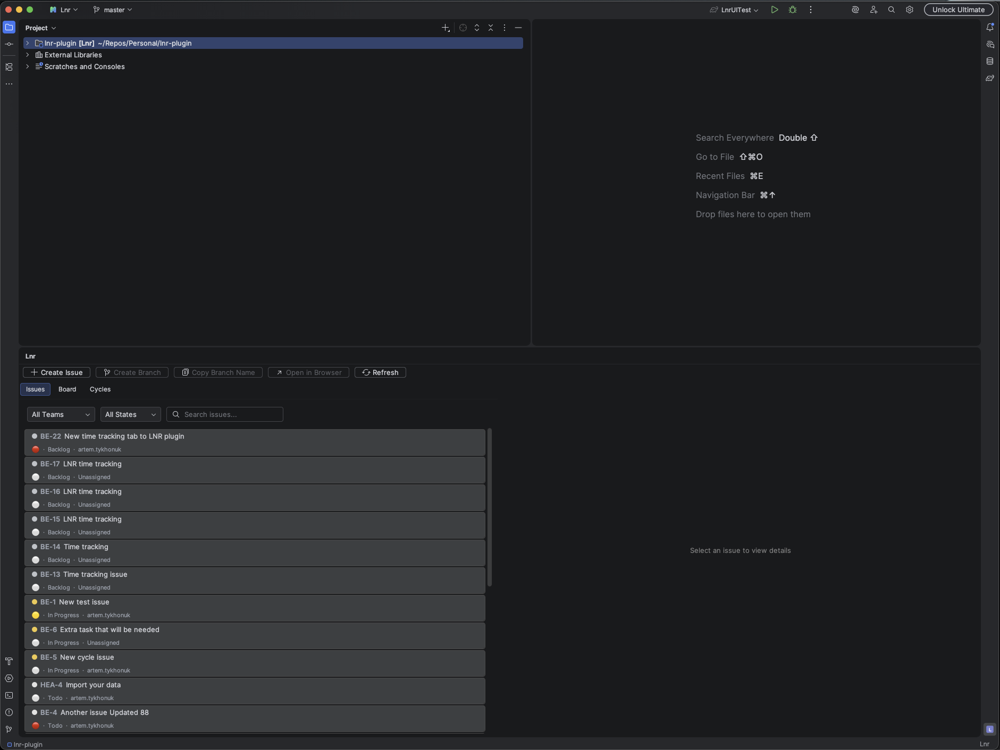
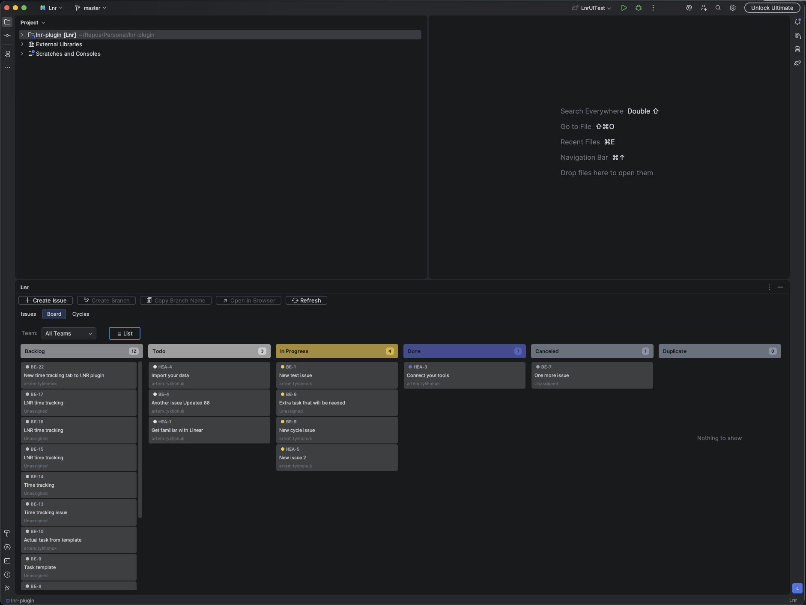
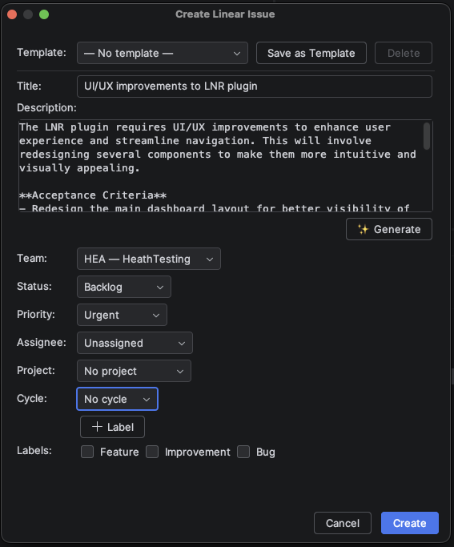
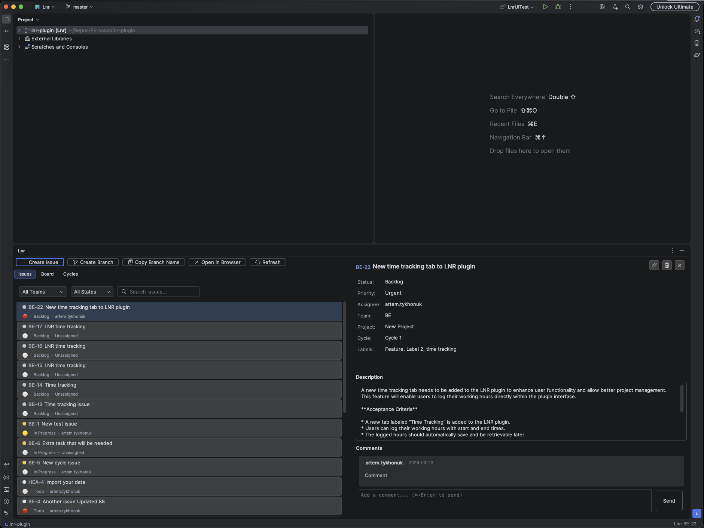
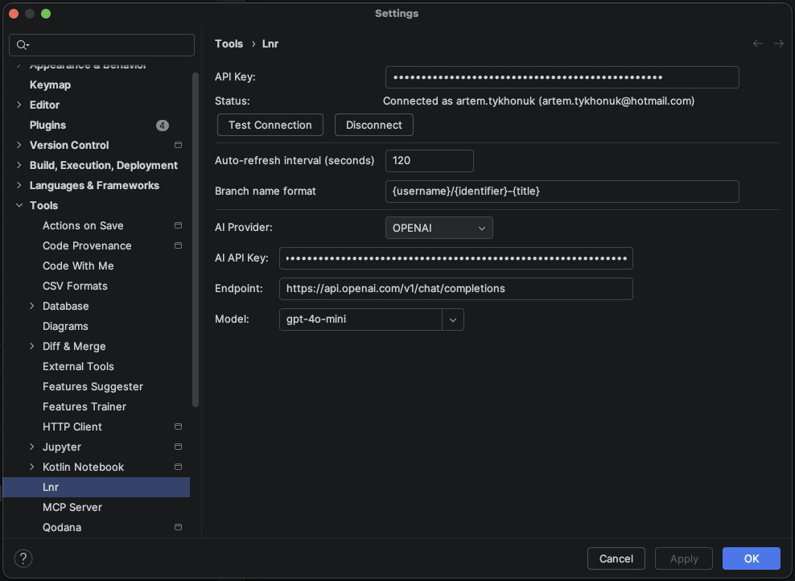
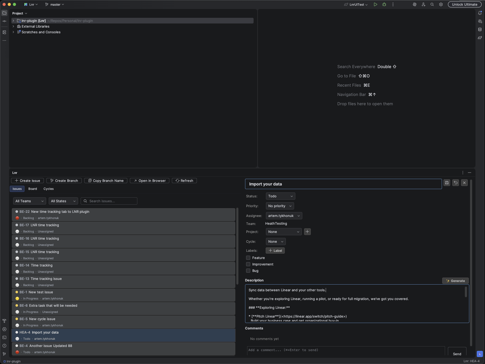
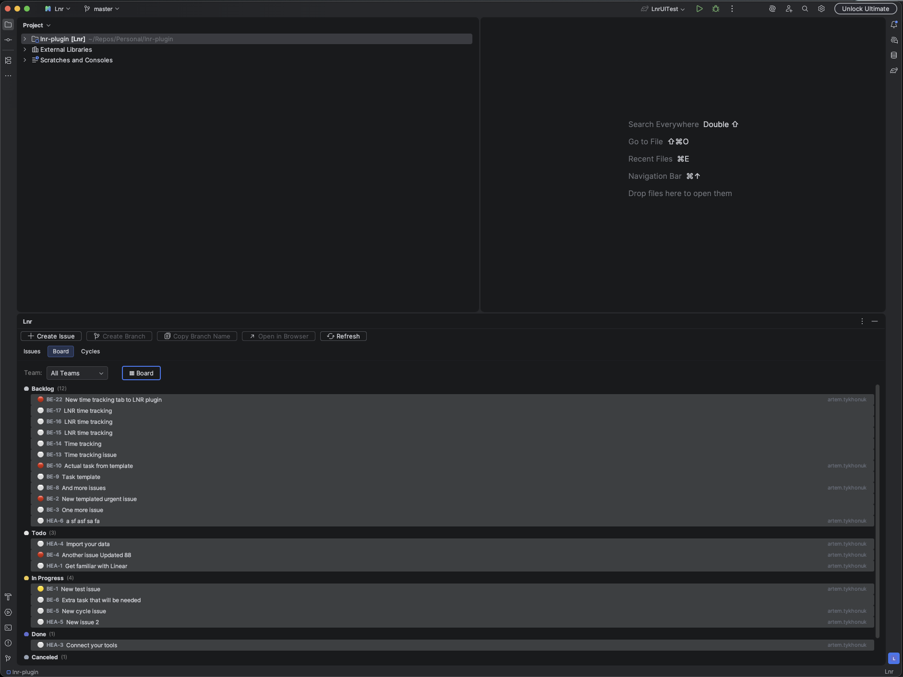
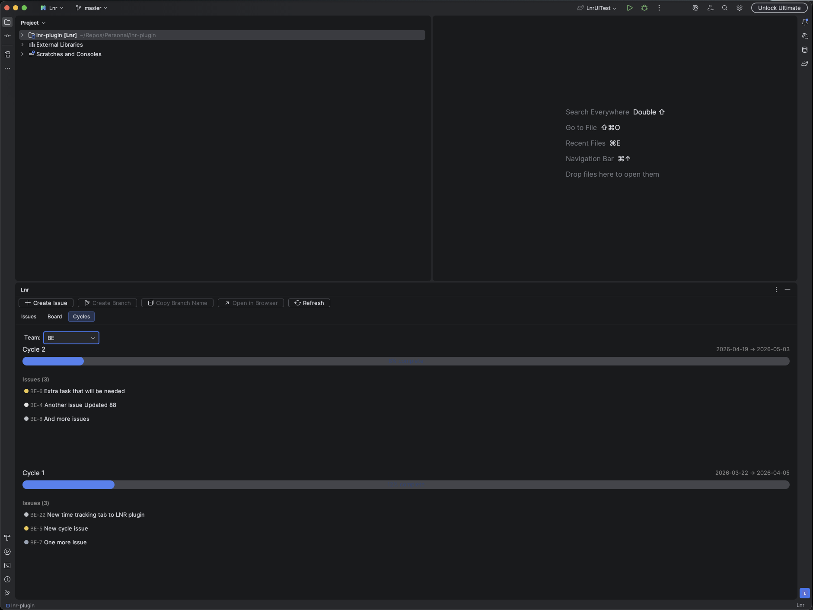

  

<h1 align="center">Lnr — Linear Integration for JetBrains IDEs</h1>

  The most complete <a href="https://linear.app">Linear.app</a> integration for JetBrains IDEs. 
  Manage issues, drag-and-drop on a Kanban board, create Git branches, generate descriptions with AI — without leaving your editor.

  
  
  

---

## ✨ Features

### Issue Management
- Browse, search, and filter Linear issues directly from the IDE
- Create issues with full field support — title, description, team, state, priority, assignee, project, cycle, and labels
- Edit issues inline — modify all fields without opening Linear
- View and post comments with `Cmd+Enter` / `Ctrl+Enter`
- "All Teams" mode — manage issues across all your Linear teams in one place

### Kanban Board
- **Board view** — columns grouped by workflow state with color-coded headers
- **List view** — collapsible grouped rows in Linear's style
- **Drag-and-drop** to change issue status
- Toggle between views — your preference is remembered across sessions

### AI-Powered Description Generation
- Generate structured issue descriptions from a title and optional context
- **Dual AI provider support:**
  - **JetBrains AI Assistant** — zero configuration, uses your existing AI setup
  - **OpenAI-compatible (BYOK)** — bring your own API key (GPT-4o, Claude, Ollama, etc.)
- Available in both Create Issue and Edit Issue flows

### Git Integration
- Create and auto-checkout branches named after the selected issue
- Copy formatted branch name to clipboard
- Smart commit message prefixing with the current issue identifier

### Cycles & Workflow
- Cycle tracking with progress indicators
- Team selector in the Cycles tab
- Auto-refresh with configurable interval and exponential backoff
- Status bar widget showing Linear connection status

### Issue Templates
- Save frequently used issue configurations as reusable local templates
- Quick-apply from a dropdown in the Create Issue dialog

---

## 🖥 Supported IDEs

Lnr works with **all JetBrains IDEs**:

IntelliJ IDEA · WebStorm · PyCharm · Rider · GoLand · PhpStorm · CLion · RubyMine · DataGrip · DataSpell · Aqua · RustRover · Fleet

---

## 📸 Screenshots

| Issue List | Kanban Board | Create Issue |
|:---:|:---:|:---:|
|  |  |  |

| Issue Detail | Settings | AI Generate |
|:---:|:---:|:---:|
|  |  |  |

| Kanban List | Cycles |
|:---:|:---:|
|  |  |

---

## 🚀 Installation

### From JetBrains Marketplace (Recommended)

1. Open your JetBrains IDE
2. Go to **Settings** → **Plugins** → **Marketplace**
3. Search for **"Lnr"**
4. Click **Install** and restart your IDE

Or install directly from the [JetBrains Marketplace page](https://plugins.jetbrains.com/plugin/XXXXX-lnr).

### Manual Installation

1. Download the latest `.zip` from the [JetBrains Marketplace](https://plugins.jetbrains.com/plugin/XXXXX-lnr)
2. Go to **Settings** → **Plugins** → ⚙️ → **Install Plugin from Disk...**
3. Select the downloaded `.zip` file and restart your IDE

---

## ⚙️ Setup

1. Get a **Linear API key** from [Linear Settings → API](https://linear.app/settings/api)
2. In your IDE, go to **Settings** → **Tools** → **Lnr**
3. Paste your API key and click **Test Connection**
4. Open the **Lnr** tool window from the right sidebar

### AI Configuration (Optional)

To enable AI-powered description generation:

- **JetBrains AI Assistant** — just select it in the dropdown (requires AI Assistant plugin)
- **OpenAI-compatible** — enter your API key, endpoint, and select a model

---

## ⌨️ Keyboard Shortcuts

| Shortcut | Action |
|----------|--------|
| `C` | Create Issue |
| `Ctrl+Shift+B` / `Cmd+Shift+B` | Create Branch |
| `Ctrl+Shift+C` / `Cmd+Shift+C` | Copy Branch Name |
| `O` | Open in Browser |
| `R` | Refresh |
| `Esc` | Close detail panel |

---

## 📋 Requirements

- JetBrains IDE version **2024.2** or later
- [Linear](https://linear.app) account with API key
- Git (for branch creation features)
- JetBrains AI Assistant plugin (optional, for AI generation)

---

## 🐛 Found a Bug?

Please [open an issue](https://github.com/ArtemTykhonuk/LnrPlugin-Public/issues/new?template=bug_report.md) with steps to reproduce. Include your IDE version and Lnr version.

## 💡 Feature Request?

We'd love to hear your ideas! [Submit a feature request](https://github.com/ArtemTykhonuk/LnrPlugin-Public/issues/new?template=feature_request.md).

---

## 📖 Changelog

See [CHANGELOG.md](CHANGELOG.md) for a full list of changes in each version.

---

## 🔒 Privacy & Security

- Your Linear API key is stored securely via JetBrains [PasswordSafe](https://plugins.jetbrains.com/docs/intellij/persisting-sensitive-data.html)
- All communication with Linear uses HTTPS
- No data is collected, stored, or sent to third parties
- AI features are opt-in and use only the provider you configure
- See our [Security Policy](SECURITY.md) for reporting vulnerabilities

---

## 📄 License

Lnr is a proprietary, closed-source plugin. See [LICENSE](LICENSE) for details.

© 2026 Artem Bear. All rights reserved.
